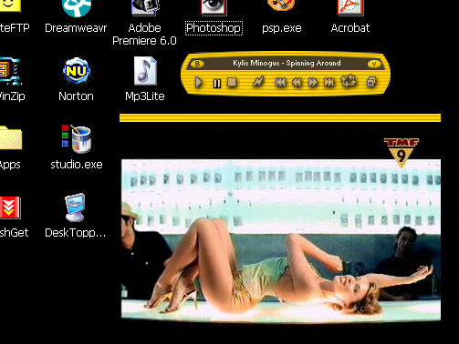



## Presto Mp3 Lite

### Description

Play your mps3 ANDm movies in yet another media player application - but this one IS COOL!! (in my humble opinion)
 
### More Info
 
You can set your file associations and mp3lite will automatically play when you click in explorer. If you open a movie that mediaplayer can handle, then a movie window opens up to show the movie - right-click on the movie titlebar to toggle between normal and double size.

             |
---                |---
**Submitted On**   |2002-05-17 02:52:22
**By**             |[Anthony Neilsen](https://github.com/Planet-Source-Code/PSCIndex/blob/master/ByAuthor/anthony-neilsen.md)
**Level**          |Intermediate
**User Rating**    |3.0 (9 globes from 3 users)
**Compatibility**  |VB 5\.0, VB 6\.0
**Category**       |[Complete Applications](https://github.com/Planet-Source-Code/PSCIndex/blob/master/ByCategory/complete-applications__1-27.md)
**World**          |[Visual Basic](https://github.com/Planet-Source-Code/PSCIndex/blob/master/ByWorld/visual-basic.md)
**Archive File**   |[Presto\_Mp3838965162002\.zip](https://github.com/Planet-Source-Code/anthony-neilsen-presto-mp3-lite__1-34849/archive/master.zip)

